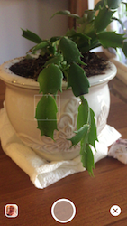
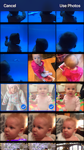

## DCCamera

This is a camera and photo picker view controller written in Objective-C.  Highly customizable and cleans up nicely when deallocating.  I've used this in previous apps but no longer maintain this code, so I'm putting the source here for those who wish to use or fork it.

### Previews




### Usage

```objc
- (void)openCamera
{
    DCCameraViewController *camera = [[DCCameraViewController alloc] init];
    [camera setDelegate:self];
    [camera setFocusSquareSize:75.0];
    [camera setMaximumNumberOfPhotoSelection:3];

    [self presentViewController:camera animated:YES completion:NULL];
}
```

```objc
- (void)dcCameraDidCancel {}
- (void)dcCameraDidTakePhoto:(UIImage *)image {}
- (void)dcCameraDidSelectImageAssets:(NSArray *)assets {}
```

### License

This project is available under the MIT license. See the LICENSE file for more info.
